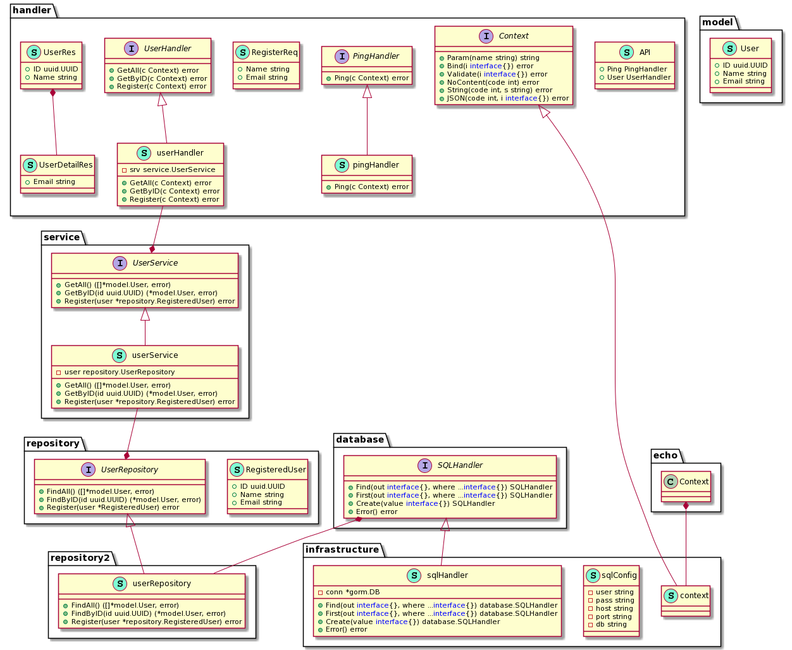

# clean-architecture-sample

[](https://codecov.io/gh/Ras96/clean-architecture-sample)



## Getting Started

### Build

```sh
docker compose up --build
```

### Test

```sh
docker compose exec app go test -v ./...
```

## Tree

```txt
$ tree
.
├── 0_domain
│   ├── model
│   │   └── user.go
│   └── repository
│       ├── mock_repository
│       │   └── mock_user_repo.go
│       └── user_repo.go
├── 1_usecase
│   └── service
│       ├── mock_service
│       │   └── mock_user_service.go
│       ├── user_service.go
│       └── user_service_test.go
├── 2_interface
│   ├── database
│   │   ├── mock_database
│   │   │   └── mock_sqlhandler.go
│   │   └── sqlhandler.go
│   ├── handler
│   │   ├── api.go
│   │   ├── api_test.go
│   │   ├── context.go
│   │   ├── mock_handler
│   │   │   ├── mock_context.go
│   │   │   ├── mock_ping_handler.go
│   │   │   └── mock_user_handler.go
│   │   ├── ping_handler.go
│   │   ├── ping_handler_test.go
│   │   ├── user_handler.go
│   │   └── user_handler_test.go
│   └── repository
│       ├── user_repo.go
│       └── user_repo_test.go
├── 3_infrastructure
│   ├── context.go
│   ├── router.go
│   ├── sqlhandler.go
│   ├── wire.go
│   └── wire_gen.go
├── Dockerfile
├── README.md
├── architecture.png
├── compose.yml
├── go.mod
├── go.sum
├── main
├── main.go
├── mysql
│   └── init
│       └── init.sql
├── tools.go
└── util
    └── random
        └── random.go
```

## References

- [Clean Coder Blog](https://blog.cleancoder.com/uncle-bob/2012/08/13/the-clean-architecture.html)
- [クリーンアーキテクチャ(The Clean Architecture 翻訳) | blog.tai2.net](https://blog.tai2.net/the_clean_architecture.html)
- [実装クリーンアーキテクチャ - Qiita](https://qiita.com/nrslib/items/a5f902c4defc83bd46b8)
- [鵜呑みにしないで！ —— 書籍『クリーンアーキテクチャ』所感 ≪null 篇 ≫ | Kabuku Developers Blog](https://www.kabuku.co.jp/developers/clean-architecture-inconsistency)
- [Go 言語と Clean Architecture で API サーバを構築する - Qiita](https://qiita.com/ariku/items/874656b33d2e5acdf281)
- [Clean Architecture で API Server を構築してみる - Qiita](https://qiita.com/hirotakan/items/698c1f5773a3cca6193e)
- [Go 言語で Clean Architecture を実現して、gomock でテストしてみた - Qiita](https://qiita.com/ogady/items/34aae1b2af3080e0fec4)
